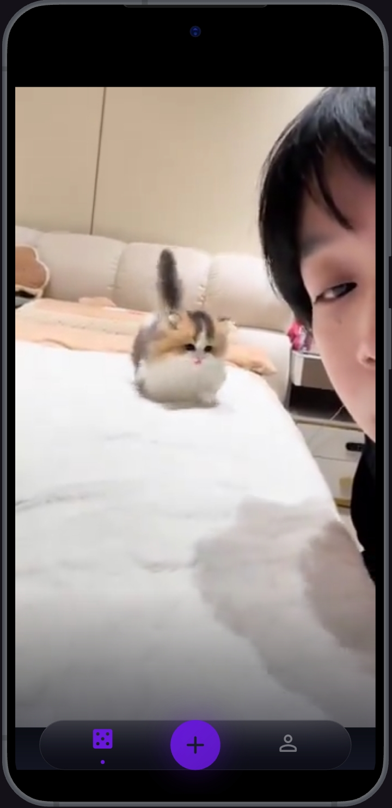
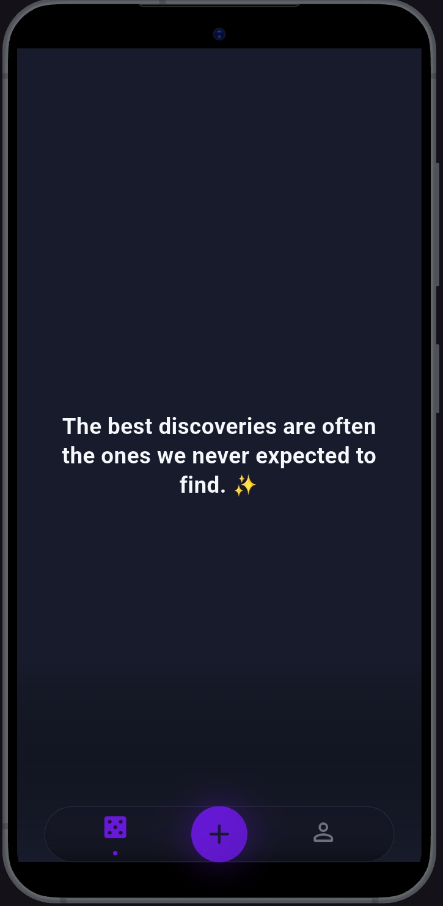
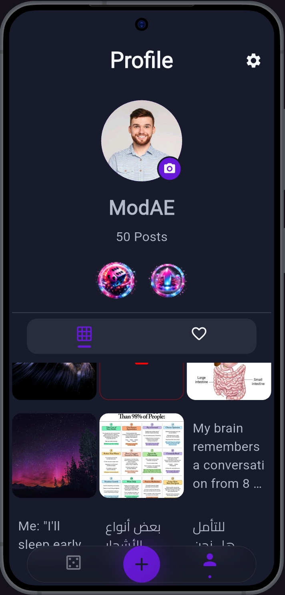
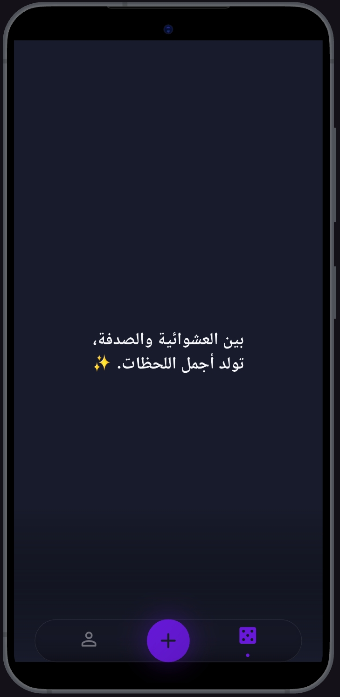
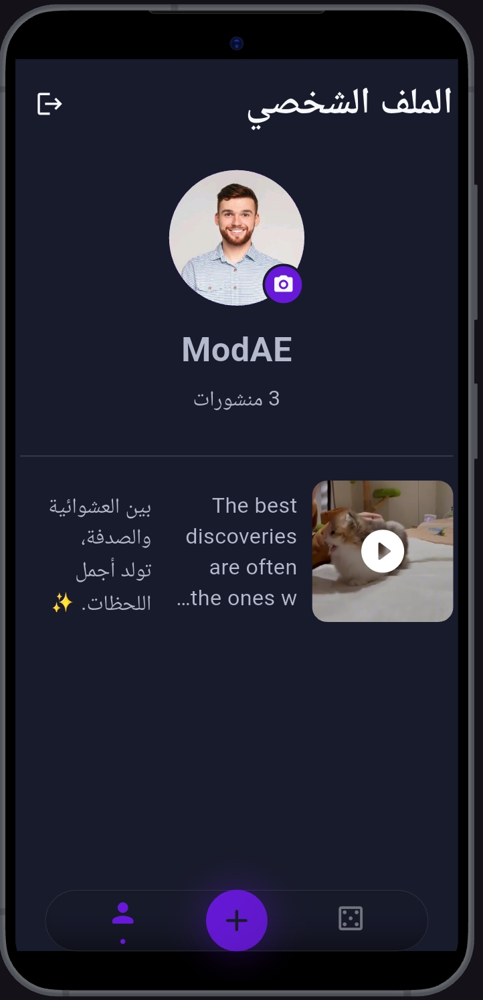

# 🎲 Randomverse

> *Social, without expectations.  
> Every post deserves a chance to be discovered.*

 

---

<h1 id="english">🇺🇸 English</h1>

<b>Click here to read in English</b>

 

## ✨ What is Randomverse?

Randomverse is a social experience built around one simple idea:

> *«Every post deserves a chance to be discovered.»*

Modern social platforms decide what you see using recommendation algorithms, popularity metrics, and engagement signals. **Randomverse takes a different approach.**

Here, every swipe is an opportunity to discover something unexpected:
* A photograph from another country.
* A thought written by someone you've never met.
* A video that would never have gone viral elsewhere.

No pressure to chase followers or compete for visibility—just content waiting to be discovered. Available on the web and Android!

---

## 🌟 Why Randomverse?

* 🎲 **Unexpected:** Every swipe is random.
* ✨ **Equal Opportunity:** Every post has a chance to be seen.
* 🌍 **Global:** Discover content from people all around the world.
* 🚫 **Algorithm-Free:** Discovery-driven over algorithm-driven.
* 🔄 **Fresh:** No two browsing sessions feel the same.
* ❤️ **Curiosity First:** Built around discovery, not popularity.

---

## 🌌 The Philosophy

> **Social, without expectations.**
> 
> There are no expectations that your content needs to go viral. No expectations that you'll only see content that looks exactly like what you've already seen before.
> 
> *Simply open the app or website, swipe, and discover something new.*

---

## 🚀 Core Features

- 🎲 **Random Feed:** Randomized post feed.
- 📝 **Express Yourself:** Share text posts, images (📸), and videos (🎥).
- 👤 **Profiles:** Personal user profiles & saved favorite posts (⭐).
- 🏅 **Early Supporters:** Founder badges.
- 🎨 **Theming:** Light/Dark modes with automatic system language & theme sync.
- 🌐 **Cross-Platform:** Access seamlessly via Web browser or Android app.
- 🚨 **Safety:** In-app reporting for inappropriate content.
- 📱 **Smooth UX:** Built for an effortless user experience.

---

## 🛡️ Privacy Matters

At Randomverse, your privacy comes first.

You can explore Randomverse and discover content **without creating an account** or sharing any personal information. An account is only required if you choose to interact (post, save favorites, customize your profile).

Any data provided is strictly used to render requested app features and is **never** collected unnecessarily.

---

## 📸 Screenshots & Preview

<table>
  <tr>
    <td align="center" width="50%">
        
      <b>🎲 Random Discovery</b>
    </td>
    <td align="center" width="50%">
        
      <b>📝 Share Your Thoughts</b>
    </td>
  </tr>
  <tr>
    <td align="center" width="50%">
        
      <b>👤 Your Space</b>
    </td>
    <td align="center" width="50%">
      <video src="https://github.com/user-attachments/assets/5d11b533-4002-4526-8d78-1022e074b801" width="220" controls></video>  
      <b>⬆️ Share With The World</b>
    </td>
  </tr>
</table>

---

## 🌐 Try Randomverse

Experience Randomverse directly in your browser or download the mobile app!

### 💻 Web App
Try it instantly without installing anything:  
👉 [**Launch Randomverse Web**](https://randomverse-social.vercel.app)

### 📱 Android Installation
1. Download the latest APK file from [**GitHub Releases**](https://github.com/MohamedAlkindi/Randomverse-App/releases/latest).
2. Open the `.apk` file on your Android device.
3. Allow installation from unknown sources if prompted.
4. Enjoy Randomverse! ❤️

---

## 🤝 Contact

Have feedback, suggestions, or want to collaborate?

📧 **Email:** [randomverse.social.official@gmail.com](mailto:randomverse.social.official@gmail.com)

---

<blockquote align="center">
  <i>Built with ❤️ and curiosity. Randomverse was created to remind us that social media can still be about discovery.</i>
</blockquote>

---

<h1 id="arabic">🇦🇪 العربية</h1>

<b>اضغط هنا لقراءة النسخة العربية</b>

 

## ✨ ما هو Randomverse؟

هو تجربة اجتماعية مبنية على فكرة بسيطة:

> *«كل منشور يستحق فرصة ليتم اكتشافه.»*

في معظم منصات التواصل الاجتماعي، تقرر الخوارزميات ما الذي يجب أن تشاهده بناءً على اهتماماتك السابقة أو التفاعل. **أما في Randomverse، فالأمر مختلف.**

كل سحب يحمل فرصة لاكتشاف شيء غير متوقع:
* صورة من مكان لم تزره من قبل.
* فكرة كتبها شخص من الطرف الآخر من العالم.
* فيديو ربما لم يكن ليحصل على فرصة للظهور في أي مكان آخر.

لا حاجة لمطاردة المشاهدات أو القلق بشأن مدى انتشار منشورك، فهنا لكل منشور فرصة حقيقية ليتم اكتشافه. متوفر عبر الويب وأجهزة أندرويد!

---

## 🌟 لماذا Randomverse؟

* 🎲 **غير متوقع:** كل سحب يحمل تجربة مختلفة.
* ✨ **فرص متساوية:** لكل منشور فرصة حقيقية للظهور.
* 🌍 **عالمي:** اكتشف محتوى من مستخدمين من مختلف أنحاء العالم.
* 🚫 **بدون خوارزميات موجهة:** تركيز كامل على الاكتشاف الحر.
* 🔄 **متجدد:** لا توجد زيارتان متشابهتان.
* ❤️ **الفضول أولاً:** تجربة مبنية على الشغف لا الشعبية.

---

## 🌌 فلسفة Randomverse

> **تجربة اجتماعية، بلا توقعات.**
> 
> لا تتوقع أن يصبح منشورك "ترند"، ولا تتوقع أن ترى نفس النوع من المحتوى في كل مرة.
> 
> *افتح موقع الويب أو التطبيق، اسحب، واكتشف شيئًا جديدًا.*

---

## 🚀 المميزات الرئيسية

- 🎲 **خلاصة عشوائية:** تغذية منشورات عشوائية بالكامل.
- 📝 **مشاركة المحتوى:** دعم النصوص، الصور (📸)، والفيديوهات (🎥).
- 👤 **الملفات الشخصية:** إدارة حسابك والمفضلة (⭐).
- 🏅 **شارة الداعمين:** شارات خاصة للمستخدمين الأوائل.
- 🎨 **المظهر:** دعم الوضع الفاتح والداكن وتوافق تلقائي مع النظام.
- 🌐 **متعدد المنصات:** استخدام سلس عبر متصفح الويب أو تطبيق أندرويد.
- 🚨 **الأمان:** إمكانية الإبلاغ عن المحتوى المخالف.
- 📱 **واجهة سلسة:** تجربة استخدام حديثة وسريعة.

---

## 🛡️ خصوصيتك مهمة!

في Randomverse، خصوصيتك تأتي دائمًا في المقام الأول.

يمكنك استكشاف المحتوى **دون الحاجة إلى إنشاء حساب** أو مشاركة بيانات شخصية. يلزم إنشاء الحساب فقط عند رغبتك بالمشاركة (النشر، التفضيل، تخصيص الملف).

أي معلومات تقدمها تُستخدم فقط لتوفير الميزات المطلوبة ولا يتم جمع أي بيانات إضافية دون حاجة.

---

## 📸 لقطات الشاشة والفيديو

<table>
  <tr>
    <td align="center" width="50%">
        
      <b>🎲 اكتشف شيئًا غير متوقع</b>
    </td>
    <td align="center" width="50%">
        
      <b>📝 شارك أفكارك</b>
    </td>
  </tr>
  <tr>
    <td align="center" width="50%">
        
      <b>👤 مساحتك الخاصة</b>
    </td>
    <td align="center" width="50%">
      <video src="https://github.com/user-attachments/assets/59fc687f-28ce-4a2a-91f3-7d8405bd061c" width="220" controls></video>  
      <b>⬆️ شارك مع العالم</b>
    </td>
  </tr>
</table>

---

## 🌐 تجربة Randomverse

يمكنك تجربة Randomverse مباشرة من متصفحك أو تحميل تطبيق الهاتف!

### 💻 موقع الويب
جربه فوراً دون الحاجة لتثبيت أي شيء:  
👉 [**افتح موقع Randomverse**](https://randomverse-social.vercel.app)

### 📱 تثبيت تطبيق أندرويد
1. قم بتحميل أحدث ملف APK من [**صفحة الإصدارات على GitHub**](https://github.com/MohamedAlkindi/Randomverse-App/releases/latest).
2. افتح الملف على جهازك.
3. اسمح بالتثبيت من مصادر غير معروفة إذا طُلب منك ذلك.
4. استمتع بـ Randomverse! ❤️

---

## 🤝 التواصل

لديك اقتراحات، ملاحظات، أو ترغب بالتعاون؟

📧 **البريد الإلكتروني:** [randomverse.social.official@gmail.com](mailto:randomverse.social.official@gmail.com)

---

<blockquote align="center">
  <i>بُني Randomverse بحب وفضول. ❤️ تم بناء التطبيق لإثبات أن منصات التواصل الاجتماعي لا تزال قادرة على أن تكون مساحة للاكتشاف الحقيقي.</i>
</blockquote>

